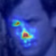
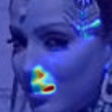
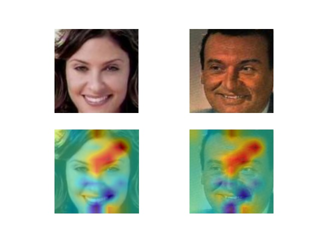
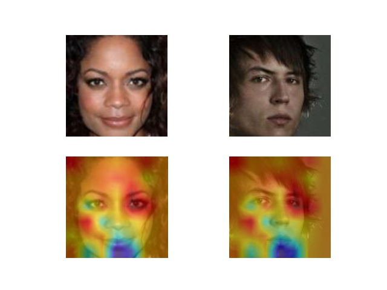
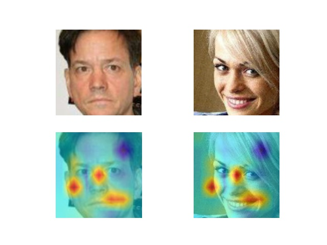
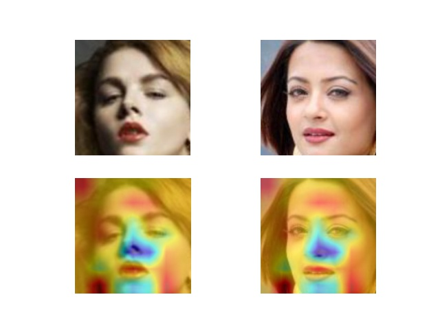

# Framework of Explaination in Face Verification

We compare with two framework: `Explainable Face Recognition (XFR)` and `xCos`

## XFR

xfr: [https://github.com/stresearch/xfr/](https://github.com/stresearch/xfr/)

please refer [test.py](xfr/demo/test.py) and [test_whitebox.py](xfr/demo/test_whitebox.py), which is ours replementation.

| Probe | Mate | Non-mate | CAM |
| -----|-|-|-|
|  |  |  |  | 
|  |  |  |  | 


## xCos

xCos: [https://github.com/ntubiolin/xcos](https://github.com/ntubiolin/xcos)

please refer `AUC.py`, `Visualization.py`, etc., for ours implementation.

Results:

| | |
|-|-|
|  |  |
|  |  |

cite:

```bibtex
@inproceedings{williford2020explainable,
  title={Explainable Face Recognition},
  author={Williford, Jonathan R and May, Brandon B and Byrne, Jeffrey},
  booktitle={European Conference on Computer Vision},
  pages={248--263},
  year={2020},
  organization={Springer}
}
```

```bibtex
@article{lin2021xcos,
  title={xCos: An explainable cosine metric for face verification task},
  author={Lin, Yu-Sheng and Liu, Zhe-Yu and Chen, Yu-An and Wang, Yu-Siang and Chang, Ya-Liang and Hsu, Winston H},
  journal={ACM Transactions on Multimedia Computing, Communications, and Applications (TOMM)},
  volume={17},
  number={3s},
  pages={1--16},
  year={2021},
  publisher={ACM New York, NY}
}
```