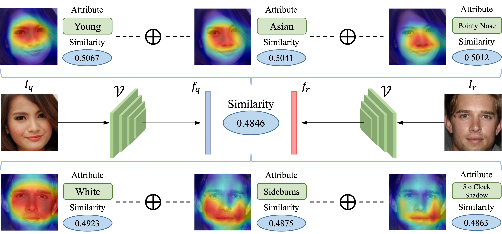
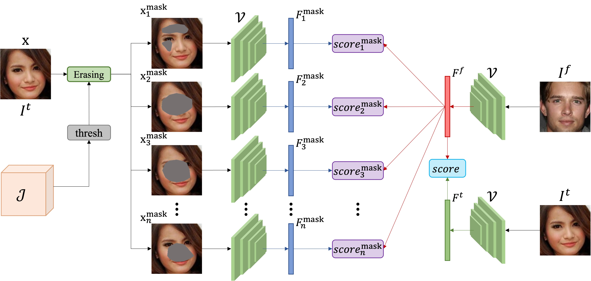
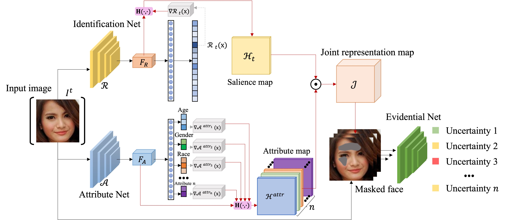

# Sim2Word
Official implement of our work: Sim2Word

Code will be released after the paper is accepted.

## 1. Overview

## 2. Explain the most discriminating attribute relative to another identity

## 3. Explain the most discriminating attributes of a person in a group

