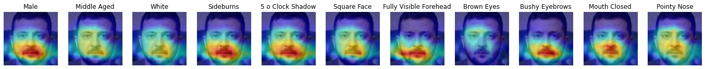

# Sim2Word


The official implementation of our work: Sim2Word: Explaining Similarity with Representative Attribute Words via Counterfactual Explanations


## Pre-train Model

In our work, we use 3 types of models for evaluation, `VGGFace Net`, `ArcFace Net`, and `CosFace Net`.

### VGGFace Net

First download the pre-trained model, the model is converted from the coffee version from the official file, don't worry it doesn't work.

| Arch type `VGGFace Net`         |                        download link                         |
| :----------------- | :----------------------------------------------------------: |
| `resnet50_ft`      | [link](https://drive.google.com/open?id=1A94PAAnwk6L7hXdBXLFosB_s0SzEhAFU) |
| `senet50_ft`       | [link](https://drive.google.com/open?id=1YtAtL7Amsm-fZoPQGF4hJBC9ijjjwiMk) |
| `resnet50_scratch` | [link](https://drive.google.com/open?id=1gy9OJlVfBulWkIEnZhGpOLu084RgHw39) |
| `senet50_scratch`  | [link](https://drive.google.com/open?id=11Xo4tKir1KF8GdaTCMSbEQ9N4LhshJNP) |

The download model is `pkl` file.

### ArcFace and CosFace checkpoints

The pre-trained model of ArcFace and CosFace is from a project on GitHub: [insightface](https://github.com/deepinsight/insightface)

- The models are available for non-commercial research purposes only.  
- All models can be found here.  
- [Baidu Yun Pan](https://pan.baidu.com/s/1CL-l4zWqsI1oDuEEYVhj-g): e8pw  
- [OneDrive](https://1drv.ms/u/s!AswpsDO2toNKq0lWY69vN58GR6mw?e=p9Ov5d)

If the above link is down, you can visit project insightface to find their checkpoints.

### Uncertainty model

The uncertainty model mentioned in our paper is also released, the implementation is from [https://github.com/RuoyuChen10/FaceTechnologyTool/FaceRecognition](https://github.com/RuoyuChen10/FaceTechnologyTool/tree/master/FaceRecognition). You can train your own model using this code.


### Attribute Net

We release our pre-trained attribute net model called `Face-Attributes2.pth`, please download and put it to fold `pre-trained`

[Google Drive](https://drive.google.com/drive/folders/1upsYYgIzyzRuNEGCc7uPQ1AZ6NcHiPbD?usp=sharing)

### Self-training model

If you want to train your own face recognition model, you can refer to our work from [https://github.com/RuoyuChen10/FaceTechnologyTool/FaceRecognition](https://github.com/RuoyuChen10/FaceTechnologyTool/tree/master/FaceRecognition), you can try:

- ArcFace Loss
- CosFace Loss
- Softmax Loss

## Prepare

please modify the variable `root_path` in file [utils.py](./utils.py):

```python
root_path = "...your_path.../Sim2Word/"
```

## Visualization Tutorial

Please refer [Visualization_tutorial.ipynb](./Visualization_tutorial.ipynb) to see the details

Input:

| Input Face  |  Counter Face  |
| - | - |
| |  |

ID-related map:

| ID MAP  |  Counter ID MAP  | Counterfactual MAP |
| - | - | - |
| |  |  |

Attribute map:


Joint Representation map:



Sorted results:


## The framework of interpreting similarity


It's the paper's Section 3 implementation, please refer to `Multi_Identity_topk.py` (set `topk = 1`).

```shell
python Multi_Identity_topk.py
```

After that, you can get the results from fold [results](./results), you can get some visualization results from a fold called `cam`, and another fold called `json` stores the experiment values, then you can use this to get quantitive results:

```
cd results
python AUC_most_attributes.py
```
Pay attention to modifying the placeholders in the Python file, such as `args.Json_fold`.

You can also use this to get the top-5 most representative attribute:

```shell
python Top_5_attributes.py
```

|||
| ------ | -|
||  |
||  |

## Discovering the most important attribute with a group of faces

This section refers to Fig. 8 in our paper, like this:


please refer to [here](./External-Experience/The_most_special_attribute/)

## Interpreting Face Identification


This section refers to Section 4 of the paper. And also the results of Fig. 9.

First, to get the inter results:

```shell
python quantity_single_person_uncertain.py
```

than:

```shell
cd results
python uncertainty_visualization.py
```

you can get some visualization like:

| | |
| - | - |
||  |
||  |

## Different Strategy

There are also some strategies in our paper, which are mentioned in Section 5.5. For the topk strategy please refer to [Multi_Identity_topk.py](Multi_Identity_topk.py), and threshold strategy refers to [Multi_identity_thresh.py](Multi_identity_thresh.py).

## Method Comparision


Please refer to fold [Explainable-Framework-Comparison](./Explainable-Framework-Comparison), and follow their command to implement the results.

## Acknowledgement

If you find this work helpful for your research, please consider citing our work:

```bibtex
@article{chen2022sim2word,
  title   = {Sim2Word: Explaining Similarity with Representative Attribute Words via Counterfactual Explanations},
  author  = {Chen, Ruoyu and Li, Jingzhi and Zhang, Hua and Sheng, Changchong and Liu, Li and Cao, Xiaochun},
  journal = {ACM Transactions on Multimedia Computing, Communications, and Applications (TOMM)},
  year    = 2022,
  publisher={ACM New York, NY}
}
```
